# Claude Code Harness — Integrated Flow Map (Public)

**Scope**: composite structural map across multiple v2.1.x builds. Tier-2 abstraction — role-level node labels, generic edge semantics. Exact function names, feature-flag identifiers, internal endpoint paths, and result-file references are redacted. Claude Desktop is out of scope; only Claude Code (WSL/binary) is mapped.

> **Version-composite disclaimer**: the three side-systems (buddy companion, advisor tool, Kairos self-continuation loop) were **never simultaneously live** in any single running build — the native buddy UI was removed mid-2.1 before the advisor feature-flag rolled out or the loop shipped. Read the diagram as a *structural map* of the harness's architectural surfaces, not as a snapshot of one installation.

---

## Diagram

```mermaid
flowchart LR
    %% ===== Startup Spine — gates every subsystem =====
    subgraph SPINE["Startup Spine"]
        direction TB
        oauth["OAuth token<br/>(credentials file)"]:::core
        firstparty["firstParty gate<br/>(Pro/Max entitlement)"]:::core
        orguuid["organizationUuid"]:::core
        providers["Provider registry<br/>firstParty / bedrock / vertex /<br/>BYOC / scaffolded-BYOC /<br/>firstParty-equivalent"]:::core
        mtls["Enterprise mTLS<br/>(strings-only)"]:::gap
        sdkrefresh["SDK OAuth refresh callback"]:::gap
        flags["Feature flags<br/>7-layer resolution<br/>(GrowthBook + Statsig +<br/>policy + session/project/env)"]:::core
        envkill["Env kill switches<br/>(disable-family)"]:::core
        settings["User settings<br/>+ per-user config"]:::core
    end

    %% ===== Core Runtime — per-turn loop =====
    subgraph CORE["A — Core Runtime"]
        direction TB
        startup["Startup bootstrap"]:::core
        model_router["Model router"]:::gap
        msgs_api["Messages API client<br/>POST /v1/messages"]:::core
        turn_loop["Per-turn loop<br/>(ordering unverified)"]:::gap
        stream_handler["Streaming handler<br/>tool-use / tool-result"]:::core
        hook_checkpoints["Hook checkpoints<br/>(named, mostly unobserved)"]:::gap
    end

    %% ===== Side-system D: Buddy (OUTSIDE) =====
    subgraph BUDDY["D — Buddy / Companion  [OUTSIDE]"]
        direction TB
        identity["Identity pipeline<br/>(hash + PRNG + trait derivation)"]:::core
        soul["Soul LLM call<br/>(personality generation)"]:::core
        companion_cfg["Persisted companion<br/>(name, personality, hatchedAt)"]:::core
        turn_watcher["Turn-end watcher<br/>+ classifiers"]:::removed
        bi_sender["Reaction API dispatcher"]:::removed
        buddy_api(["Reaction endpoint<br/>(API live; UI removed mid-2.1)"]):::core
        sprite_ui["ASCII sprite + speech bubble"]:::removed
        intro_inject["System-prompt intro<br/>(dead filter entry post-removal)"]:::removed
    end

    %% ===== Side-system E: Advisor (INSIDE) =====
    subgraph ADVISOR["E — Advisor  [INSIDE]"]
        direction TB
        advisor_gate["Feature-gate predicate"]:::core
        advisor_validator["Input validators"]:::core
        advisor_schema["Tool schema"]:::core
        advisor_prompt["System-prompt assembly"]:::core
        advisor_tool["Tool-use inside<br/>Messages API"]:::core
        advisor_cost["Cost-tracking helpers"]:::core
        advisor_cli["CLI flag + slash command<br/>(hidden until rollout)"]:::gap
    end

    %% ===== Side-system F: Kairos Loop (AROUND) =====
    subgraph LOOP["F — Kairos Loop  [AROUND]"]
        direction TB
        sched_tool["ScheduleWakeup tool<br/>(delay / prompt / reason)"]:::core
        sentinels["Prompt sentinels<br/>(static + dynamic)"]:::core
        sched_fn["Wakeup scheduler<br/>(clamp [60, 3600]s)"]:::core
        cron_create["Cron-create<br/>(kind: loop)"]:::core
        loop_state["State keyed by prompt hash<br/>(7-day age-out default)"]:::core
        loopmd["File-sentinel resolver<br/>(loop.md)"]:::core
        loop_slash["/loop slash command"]:::core
        scheduled_tasks["On-disk task file<br/>+ lock"]:::gap
    end

    %% ===== Extension surface G: MCP =====
    subgraph MCP["G — MCP Subsystem"]
        direction TB
        mcp_config["mcpServers config"]:::core
        mcp_client["MCP client<br/>(multiple transports)"]:::core
        mcp_sandbox["Sandbox allowlist<br/>(env-driven)"]:::core
        mcp_bff["BFF registry<br/>+ legacy directory"]:::core
        mcp_oauth["Per-server OAuth<br/>(multi-step flow)"]:::core
        mcp_tools["MCP tools → tools array"]:::core
    end

    %% ===== Extension surface H: Hooks + Skills + Managed Agents =====
    subgraph EXTH["H — Hooks + Skills + Managed Agents"]
        direction TB
        hook_config["Hooks config"]:::core
        hook_pipeline["Hook subprocess pipeline<br/>(named categories, partially observed)"]:::gap
        skill_loader["Skill loader<br/>(filesystem-only)"]:::core
        dream_nightly["Nightly memory consolidation<br/>(SessionStart-triggered)"]:::gap
        subgraph MAAPI["Managed Agents API<br/>(CLI does not call; documented only)"]
            direction TB
            ma_agents["/v1/agents"]:::gap
            ma_sessions["Managed sessions endpoint"]:::gap
            ma_skills["/v1/skills"]:::gap
        end
    end

    %% ===== State layer I =====
    subgraph STATE["I — Session State"]
        direction TB
        claudejson["Per-user config file"]:::core
        credsjson["Credentials file"]:::core
        backups["Backup snapshots"]:::gap
        state_atomicity["Write atomicity<br/>(TOCTOU known, path untraced)"]:::gap
        transcript_mem["In-memory transcript"]:::core
        kairos_state["Server-side loop state<br/>(opaque)"]:::gap
    end

    %% ===== Telemetry J =====
    subgraph TEL["J — Telemetry (fan-in)"]
        direction TB
        tel_fanin["Aggregate event families<br/>(advisor / loop / MCP / SDK /<br/>OAuth / CCR / plugin / dream /<br/>API / tool-use)"]:::core
        tel_transport["Transport layer<br/>(internal batch + third-party sink)"]:::core
    end

    %% ===== CCR Cloud-Runner L =====
    subgraph CCR["L — CCR Cloud-Runner"]
        direction TB
        teleport["Teleport<br/>(workspace → cloud)"]:::core
        bridge["Bridge server<br/>(claude.ai drives local)"]:::core
        ccr_gate["CCR gate<br/>(multi-flag + policy)"]:::core
        ultrareview["Ultrareview sub-surface"]:::core
        autofix_pr["Autofix-PR sub-surface"]:::core
    end

    %% ===== Auto-Dream M =====
    subgraph DREAM["M — Auto-Dream Memory"]
        direction TB
        dream_gate["Gate predicate<br/>(interactive + firstParty +<br/>memory-enabled)"]:::core
        dream_time["Time + session gates<br/>(PID-locked)"]:::core
        dream_agent["Dream agent<br/>(skip-transcript fork)"]:::core
        dream_files["Project memory tree"]:::core
    end

    %% ===== Plugin System N =====
    subgraph PLUGINS["N — Plugin System"]
        direction TB
        plugin_mkt["Marketplace<br/>(GCS primary, git fallback)"]:::core
        plugin_load["Plugin loader<br/>(skills + agents + hooks +<br/>MCP + LSP + monitors)"]:::core
        plugin_hints["Hint system<br/>(model-response recommendation)"]:::core
        plugin_cli["CLI commands +<br/>slash commands"]:::core
    end

    %% ===== Our Tooling K =====
    subgraph OURS["K — Our Tooling / Replay"]
        direction TB
        shingle_capture["Capture pipeline<br/>(hook subprocess)"]:::ours
        shingle_mcp["Reaction MCP<br/>(bypasses binary)"]:::ours
        workspace_mcp["Workspace MCP"]:::ours
        mempalace["Cross-session memory sync"]:::ours
        workspace_ui["Workspace UI<br/>(PTY + bubbles)"]:::ours
    end

    %% ===== Spine edges =====
    oauth --> firstparty
    firstparty --> orguuid
    oauth --> providers
    providers -. "enterprise / BYOC" .-> mtls
    oauth -. "401 refresh" .-> sdkrefresh
    firstparty --> flags
    flags --> envkill
    settings --> flags

    %% Spine → Core Runtime
    oauth --> startup
    flags --> startup
    settings --> startup
    startup --> model_router
    model_router --> msgs_api
    msgs_api --> turn_loop
    turn_loop --> stream_handler
    turn_loop -. "ordering unverified" .-> hook_checkpoints

    %% Spine → Side-systems (flag-gated)
    flags -. "date + firstParty" .-> identity
    flags -. "advisor gate" .-> advisor_gate
    flags -. "loop gate" .-> sched_tool
    flags -. "MCP namespace" .-> mcp_client
    flags --> hook_pipeline

    %% D — Buddy flows (OUTSIDE)
    identity --> soul
    soul --> companion_cfg
    companion_cfg --> claudejson
    turn_loop -. "turn-end (pre-removal)" .-> turn_watcher
    turn_watcher --> bi_sender
    bi_sender -- "reaction POST" --> buddy_api
    buddy_api -. "render (pre-removal)" .-> sprite_ui
    companion_cfg -. "pre-removal" .-> intro_inject
    intro_inject -. "dead filter" .-> msgs_api

    %% E — Advisor flows (INSIDE)
    advisor_gate --> advisor_validator
    advisor_validator --> advisor_schema
    advisor_schema -- "tools array + beta" --> msgs_api
    advisor_prompt -- "appended to system" --> msgs_api
    stream_handler -. "server tool-use (never observed)" .-> advisor_tool
    advisor_tool --> advisor_cost
    advisor_cli -. "writes advisor model" .-> claudejson

    %% F — Loop flows (AROUND)
    stream_handler -- "ScheduleWakeup tool-use" --> sched_tool
    sched_tool --> sched_fn
    sched_fn --> cron_create
    cron_create --> loop_state
    loop_state -. "durable" .-> scheduled_tasks
    sentinels -- "resolved at fire" --> loopmd
    loop_slash --> sched_fn
    loop_state -- "cron fire → new turn" --> turn_loop

    %% G — MCP flows
    mcp_config --> mcp_client
    mcp_client --> mcp_sandbox
    mcp_client --> mcp_bff
    mcp_client --> mcp_oauth
    mcp_client --> mcp_tools
    mcp_tools --> msgs_api

    %% L — CCR flows
    flags -. "CCR multi-gate" .-> ccr_gate
    ccr_gate --> teleport
    ccr_gate --> bridge
    ccr_gate --> ultrareview
    ccr_gate --> autofix_pr
    teleport -. "workspace bundle" .-> msgs_api
    bridge -- "remote session events" --> stream_handler

    %% M — Auto-Dream flows
    flags -. "dream config" .-> dream_gate
    dream_gate --> dream_time
    dream_time -- "gates met" --> dream_agent
    dream_agent -- "write" --> dream_files

    %% N — Plugin flows
    startup --> plugin_load
    plugin_mkt --> plugin_load
    plugin_load --> mcp_client
    plugin_load --> skill_loader
    plugin_load --> hook_pipeline
    plugin_hints -. "model response hint" .-> stream_handler

    %% H — Hooks + Skills + Managed Agents
    hook_config --> hook_pipeline
    turn_loop -- "checkpoint fires" --> hook_pipeline
    hook_pipeline -. "PreToolUse rewrite?" .-> stream_handler
    skill_loader -- "slash resolution" --> turn_loop
    hook_pipeline -. "SessionStart" .-> dream_nightly
    subagent_note["Subagent-stop + Agent tool"]:::gap
    hook_pipeline -. "SubagentStop" .-> subagent_note
    subagent_note -. "caller unmapped" .-> MAAPI

    %% I — State flows
    turn_loop -. "turn-end<br/>atomicity unverified" .-> state_atomicity
    state_atomicity -. "write path untraced" .-> claudejson
    state_atomicity -. "trigger condition unknown" .-> backups
    sdkrefresh -. "writeback? unverified" .-> credsjson
    loop_state -. "server-side" .-> kairos_state
    transcript_mem -- "hook payload" --> hook_pipeline

    %% J — Telemetry fan-in
    advisor_cost -. "never observed" .-> tel_fanin
    sched_fn --> tel_fanin
    loop_slash --> tel_fanin
    msgs_api --> tel_fanin
    sdkrefresh --> tel_fanin
    mcp_client --> tel_fanin
    teleport --> tel_fanin
    bridge --> tel_fanin
    ultrareview --> tel_fanin
    autofix_pr --> tel_fanin
    plugin_load --> tel_fanin
    dream_agent --> tel_fanin
    stream_handler --> tel_fanin
    tel_fanin --> tel_transport

    %% K — Our tooling
    hook_pipeline -- "UserPromptSubmit / Stop" --> shingle_capture
    shingle_capture -- "API replay" --> buddy_api
    shingle_mcp -- "bypass binary" --> buddy_api
    workspace_mcp --> mcp_client
    workspace_ui --> shingle_capture
    shingle_capture --> mempalace

    %% ===== Classes =====
    classDef core fill:#0d2340,stroke:#3b9eff,color:#e8f4ff,stroke-width:3px
    classDef gap fill:#3b0a0a,stroke:#ff5555,color:#ffd0d0,stroke-dasharray:6 3,stroke-width:3px
    classDef removed fill:#0d0d0d,stroke:#888888,color:#aaaaaa,stroke-dasharray:4 4,stroke-width:2px
    classDef ours fill:#1a0833,stroke:#bf7fff,color:#f0e0ff,stroke-width:3px
```

---

## Cluster Legend

| Cluster | Role | Lifecycle position |
|---|---|---|
| **Startup Spine** | OAuth + provider registry + multi-layer flags + config; gates every subsystem | startup-only |
| **A — Core Runtime** | Runtime, model router, Messages API client, per-turn loop, streaming handler | startup → per-turn |
| **D — Buddy** `[OUTSIDE]` | Identity pipeline + reaction dispatch to a separate endpoint; native UI removed mid-2.1, API lives | startup + per-turn-end |
| **E — Advisor** `[INSIDE]` | Server-side tool inside Messages API; model-initiated consultation to stronger reviewer | per-turn (tool call) |
| **F — Kairos Loop** `[AROUND]` | `ScheduleWakeup` + `/loop`; ends turn, schedules future turn via cron | per-turn + background |
| **G — MCP** | Multi-transport client; per-server OAuth; BFF registry; sandbox allowlist | startup + per-turn |
| **H — Hooks + Skills + Managed Agents** | Extension surface: subprocess hooks, skill loader, nightly memory, Managed Agents API (documented only) | all three phases |
| **I — State** | Persisted config, credentials, backups, in-memory transcript, server-side loop state | all three phases |
| **J — Telemetry** | Fan-in from every subsystem; internal batch endpoint + third-party sink | per-turn + background |
| **K — Our Tooling / Replay** | Hook-subprocess capture, reaction-replay MCP, workspace MCP, cross-session memory sync, workspace UI | per-turn + offline |
| **L — CCR Cloud-Runner** | Teleport + Bridge + sub-surfaces (Ultrareview, Autofix-PR) | on-demand |
| **M — Auto-Dream** | Background memory consolidation scheduler; time + session gates with PID lock | background |
| **N — Plugins** | First-party extension distribution; marketplace + git fallback; six extension types | startup + on-demand |

## Edge-Semantics Legend

| Style | Meaning |
|---|---|
| Solid arrow | Runtime data/control flow verified in source or empirically captured |
| Dashed arrow | Configuration, optional, inferred, or structurally unverified |
| Labeled edge | Semantics matter — endpoint, protocol, or trigger reason shown |
| `core` (blue) | Verified component |
| `gap` (red dashed) | Named but not traced, or structurally unresolved |
| `removed` (grey dashed) | Code removed mid-2.1; included to preserve historical structure |
| `ours` (violet) | Our tooling — replay against surfaces, not first-party |

## The Three-Direction Figure

The dominant structural pattern in the harness:

- **INSIDE** the per-turn Messages API call → **Advisor** (server-side tool, full context, bidirectional)
- **OUTSIDE** the per-turn loop via a separate endpoint → **Buddy** (read-only observer, truncated context)
- **AROUND** the per-turn loop by ending and re-entering → **Kairos Loop** (self-continuation across turns)

The three side-systems clip onto the same spine (auth → flags → core runtime) but do not compose. They share OAuth + firstParty + org-scoping; otherwise they are wired independently, built by different teams, at different versions. **The harness grows by accretion, not composition.**

---

## Five Structural Findings

Available only from the panoramic view — none of these emerge from reading any single cluster:

1. **The harness grows by accretion, not composition.** The three side-systems share OAuth + firstParty + org-scoping and nothing else. Future subsystems will clip on independently. The three-direction figure (inside / outside / around) is the predictive shape.

2. **Feature flags are the actual backbone, not the core runtime.** Every subsystem's first inbound edge is from the flag layer. The runtime is what executes; flags decide what exists at all.

3. **The Managed Agents API is a structural bridge, not a leaf node.** It sits at the intersection of MCP extension, hook/skill extension, and potentially future buddy resurrection. Present investigation treats this as a hypothesis to test, not a prediction with mechanical support.

4. **Our tooling is a parallel pipeline, not a downstream consumer.** The hook-subprocess capture enters via the extension surface; the reaction-replay MCP bypasses the binary entirely. We re-created the buddy loop the binary removed, by reading the harness through one surface and writing to another. The two pipelines are architecturally indistinguishable at the API layer.

5. **Telemetry is a fan-in black box.** Every subsystem emits; transport is unobserved at any depth. The diagram's largest dead-reckoned region is right here, and it is the single most tractable next-investigation target.

---

*Tier-2 public redraw. The private source map documents specific function names, flag identifiers, and internal endpoint paths; those have been generalised here to role-level descriptors.*
