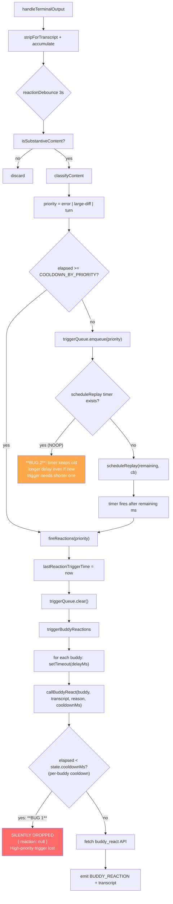

# Trigger Flow: handleTerminalOutput to buddy reactions

## State Diagram



## Two independent cooldown systems

| Layer | Variable | Scope | Priority-aware? |
|-------|----------|-------|-----------------|
| Workspace | `lastReactionTriggerTime` + `COOLDOWN_BY_PRIORITY` | Shared across all buddies | Yes |
| Per-buddy API | `state.lastCallTime` + `state.cooldownMs` | Per individual buddy | **No** |

## Bug 1: Per-buddy cooldown ignores trigger priority

`callBuddyReact` uses a single `state.cooldownMs` (from session config, typically 8-10s) regardless of whether the trigger is an error, large-diff, or normal turn. A high-priority trigger that passes the workspace gate can be silently dropped per-buddy.

**Reproduction timeline:**
```
t=0s    "turn" fires via fireReactions
        -> callBuddyReact per buddy, API returns reaction
        -> state.lastCallTime = ~0.5s (after delayMs)

t=3s    "error" content arrives
        -> workspace check: elapsed=3s >= COOLDOWN_BY_PRIORITY.error(3s) -> PASSES
        -> fireReactions("error")
        -> callBuddyReact per buddy
        -> per-buddy check: elapsed=2.5s < state.cooldownMs(8000) -> BLOCKED
        -> { reaction: null, error: "Cooldown: 6s remaining" }
        -> error trigger is LOST -- no retry, no re-queue
```

## Bug 2: Replay timer doesn't shorten for higher-priority triggers

`scheduleReplay` is a NOOP when a timer already exists. If a "turn" is suppressed and schedules a 9-second replay, then an "error" gets suppressed 1 second later needing only a 1-second replay, the error is stuck waiting 8 more seconds behind the turn's timer.

**Reproduction timeline:**
```
t=0s    "error" fires

t=1s    "turn" arrives, suppressed (turn cooldown=10s, remaining=9s)
        -> enqueue("turn"), scheduleReplay(9s)  -- timer fires at t=10s

t=2s    "error" arrives, suppressed (error cooldown=3s, remaining=1s)
        -> enqueue("error") -- error replaces turn (higher priority)
        -> scheduleReplay(1s) -- NOOP! timer already exists
        -> error waits until t=10s instead of t=3s
```
